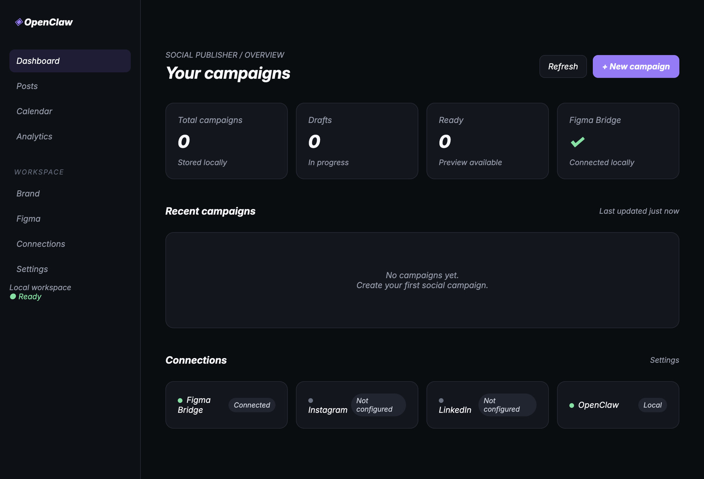

# OpenClaw Social Publisher

A local-first open-source foundation for generating, designing, previewing, validating and publishing social campaigns with OpenClaw and Figma.

## Status

The current milestone includes a SQLite repository, dynamic campaign core, dashboard/API, localhost Figma bridge, generic development plugin, dry-run adapters, CI and documentation. Live platform publication and verified Figma Desktop export are not claimed yet.

## Quick start

    ./install.sh
    pnpm doctor
    pnpm dev

For a safe workflow simulation: `pnpm dry-run`.

## Architecture

OpenClaw -> Social Publisher Core -> SQLite -> Dashboard / Figma Bridge -> Figma Plugin -> Instagram / LinkedIn adapters

## Safety

No production BRHCRÉA files are modified. No test publishes to social accounts. Runtime databases, credentials and personal paths are excluded from Git.

See docs/getting-started.md, docs/architecture.md, docs/security.md and CHANGELOG.md.

## License

MIT
